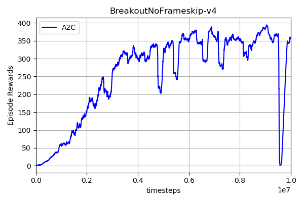

# Synchronous Advantage Actor-Critic (A2C)
This is the pytorch version of the A2C - **which is basiclly the same as the openai baselines** 
## Requirements
- python-3.5.2
- openai baselines
- pytorch-0.4.0
## Installation
Install OpenAI Baselines
```bash
# clone the openai baselines
git clone https://github.com/openai/baselines.git
cd baselines
pip install -e .

```
## How to use the code
Train the network:
```bash
python train --env-name 'BreakoutNoFrameskip-v4' --cuda (if you have the GPU)

```
Test the network:
```bash
python demo.py --env-name 'BreakoutNoFrameskip-v4'

```
## Training Performance

## Demo


