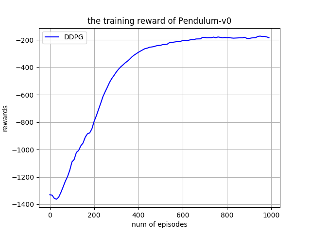

# Deep Deterministic Policy Gradient (DDPG)
This is the pytorch version of the DDPG. The paper could be found [Here](https://arxiv.org/abs/1509.02971).
## Requirements
- python-3.5.2
- openai-gym
- pytorch-0.4.0

## How to use the code
Train the network:
```bash
python train --cuda (if you use GPU)

```
Test the network:
```bash
python demo.py

```
## Training Curve

## Demo


